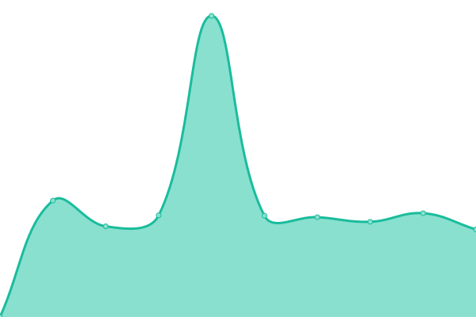
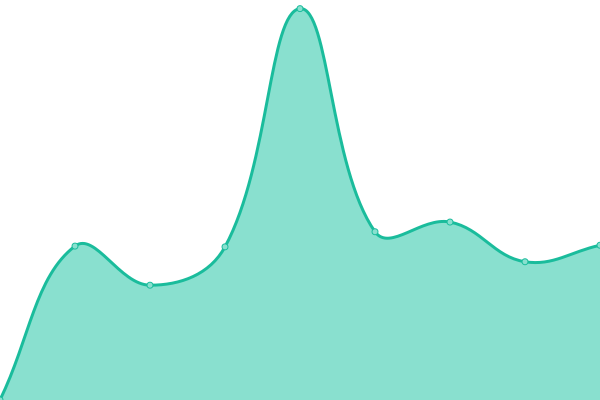

# [📈 Live Status](https://upptime.github.io/upptime): <!--live status--> **🟧 Partial outage**

This repository contains the open-source uptime monitor and status page for [Upptime](https://upptime.js.org), powered by [Upptime](https://github.com/upptime/upptime).

With [Upptime](https://upptime.js.org), you can get your own unlimited and free uptime monitor and status page, powered entirely by a GitHub repository. We use [Issues](https://github.com/upptime/upptime/issues) as incident reports, [Actions](https://github.com/codustry/smart-patrol-status/actions) as uptime monitors, and [Pages](https://upptime.github.io/upptime) for the status page.

<!--start: status pages-->
<!-- This summary is generated by Upptime (https://github.com/upptime/upptime) -->
<!-- Do not edit this manually, your changes will be overwritten -->
<!-- prettier-ignore -->
| URL | Status | History | Response Time | Uptime |
| --- | ------ | ------- | ------------- | ------ |
|  [Prod Wev](https://smartpatrol.dmcr.go.th/) | 🟥 Down | [prod-wev.yml](https://github.com/codustry/smart-patrol-status/commits/HEAD/history/prod-wev.yml) | 

 0ms
     
 | 

<a href="https://codustry.github.io/smart-patrol-status/history/prod-wev">0.00%</a>
    

|  [Prod API](https://smartpatrol.dmcr.go.th/api/health) | 🟥 Down | [prod-api.yml](https://github.com/codustry/smart-patrol-status/commits/HEAD/history/prod-api.yml) | 

 0ms
     
 | 

<a href="https://codustry.github.io/smart-patrol-status/history/prod-api">0.00%</a>
    

|  [Prod Geoserver](http://gis-smartpatrol.dmcr.go.th/geoserver) | 🟩 Up | [prod-geoserver.yml](https://github.com/codustry/smart-patrol-status/commits/HEAD/history/prod-geoserver.yml) | 

 1615ms
     
 | 

<a href="https://codustry.github.io/smart-patrol-status/history/prod-geoserver">100.00%</a>
    

|  [Azure Dev Web](https://smartpatrol3.nutchanon.org/) | 🟩 Up | [azure-dev-web.yml](https://github.com/codustry/smart-patrol-status/commits/HEAD/history/azure-dev-web.yml) | 

 1418ms
     
 | 

<a href="https://codustry.github.io/smart-patrol-status/history/azure-dev-web">100.00%</a>
    

|  [Azure API](https://smartpatrol3.nutchanon.org/api/health) | 🟩 Up | [azure-api.yml](https://github.com/codustry/smart-patrol-status/commits/HEAD/history/azure-api.yml) | 

 259ms
     
 | 

<a href="https://codustry.github.io/smart-patrol-status/history/azure-api">100.00%</a>
    

|  [Dev Web](https://smartpatrol2.nutchanon.org/) | 🟥 Down | [dev-web.yml](https://github.com/codustry/smart-patrol-status/commits/HEAD/history/dev-web.yml) | 

 2796ms
     
 | 

<a href="https://codustry.github.io/smart-patrol-status/history/dev-web">0.00%</a>
    

|  [Dev API](https://smartpatrol2.nutchanon.org/api/health) | 🟥 Down | [dev-api.yml](https://github.com/codustry/smart-patrol-status/commits/HEAD/history/dev-api.yml) | 

 1604ms
     
 | 

<a href="https://codustry.github.io/smart-patrol-status/history/dev-api">26.42%</a>
    

<!--end: status pages-->

[**Visit our status website →**](https://upptime.github.io/upptime)

## 📄 License

- Powered by: [Upptime](https://github.com/upptime/upptime)
- Code: [MIT](./LICENSE) © [Upptime](https://upptime.js.org)
- Data in the `./history` directory: [Open Database License](https://opendatacommons.org/licenses/odbl/1-0/)
